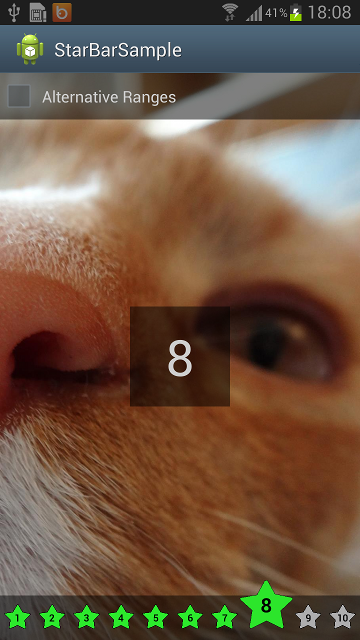

StarBar
========

A custom View class implementing a rating bar with 10 stars. The user can touch or swipe to select a rating between 1 and 10.
The StarBar supports three rating ranges (red, yellow and green) that are indicated by different colored stars.

Usage
-----
_For a working example of how to use StarBar see the Android project in the **sample** folder_.

**1. Including the StarBar library project**

StarBar is provided as an Android library project. See the Android developer website for information on how include and use library projects.

[Referencing a Library Project](http://developer.android.com/tools/projects/projects-eclipse.html#ReferencingLibraryProject)

**2. Add StarBar to your layout**
    <RelativeLayout xmlns:android="http://schemas.android.com/apk/res/android"
        xmlns:tools="http://schemas.android.com/tools"
        android:layout_width="match_parent"
        android:layout_height="match_parent" >
    
        <com.badoo.starbar.StarBar
            android:id="@+id/starBar"
            android:layout_width="fill_parent"
            android:layout_height="wrap_content"
            android:layout_alignParentBottom="true" />
    
    </RelativeLayout>
There are some restrictions on what you can specify for **layout_width** and **layout_height**.

* **layout_width** must either be **match_parent** / **fill_parent** or fixed width.
* **layout_height** must be **wrap_content**.

**3. Configuring rating ranges**

StarBar has three rating ranges. These ranges control what colour should be used when
the rating stars are drawn. By default the following ranges are used:

* 1-3: Red
* 4-6: Yellow
* 7-10: Green

If you want to override these are use different ranges it can be done by calling the following method in RatingBar.

    public void setRanges(int yellow, int green)

**Example:** To set the ranges to the defaults listed above use:

    starBar.setRanges(4, 7);

**4. Setting a listener to handle rating callbacks**

After adding the StarBar to your layout it should already work but it will not do anything when the user picks a rating.

    StarBar starBar = (StarBar) findViewById(R.id.starBar);
    starBar.setOnRatingSliderChangeListener(new OnRatingSliderChangeListener() {

        @Override
        public boolean onStartRating() {
            // The user has initiated a rating by touching the StarBar. This call will
            // immediately followed by a call to onPendingRating with the initial rating
            // value.   
        }
    
        @Override
        public void onPendingRating(int rating) {
            // This method will first be called when the user initiates a rating and then
            // subsequently as the rating is updated (by the user swiping his finger along 
            // the bar).
        }
    
        @Override
        public void onFinalRating(int rating, boolean swipe) {
            // If the rating is completed successfully onFinalRating is called with the
            // final result. The swipe parameter specifies if the rating was done using
            // a tap (false) or a swipe (true).
        }
    
        @Override
        public void onCancelRating() {
            // Called if the user cancels the rating by swiping away from the StarBar and releasing.
        }
    });

Credits
-------

StarBar is is brought to you by [Badoo Trading Limited](http://corp.badoo.com) and it is released under the [MIT License](http://copyfree.org/licenses/mit/license.txt).

Created by [Erik Andre](http://www.linkedin.com/pub/erik-andr%C3%A9/7/252/484)
